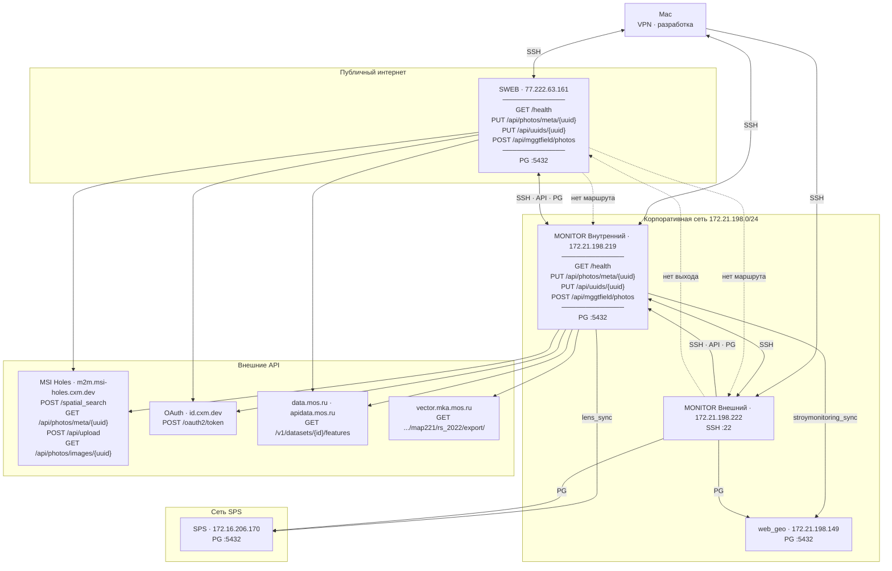

# MONITOR — статус доступности функций

**Основной сервер:** **MONITOR Внутренний** — `172.21.198.219` (`LEN-MOSTRRAB-DCR-01P`, RED OS 8.0.2)  
**Путь проекта:** `/opt/monitor`  
**Дата проверки:** 2026-07-01 (MSK)  
**Предыдущий сервер:** **SWEB** — `77.222.63.161` (MONITOR **ещё запущен**)  
**Рабочая станция:** **MONITOR Внешний** — `172.21.198.222` (`LEN-MONSTRRAB-01P`, только SSH)

---

## Узлы инфраструктуры

| Имя | IP | Hostname | Роль | Сервисы |
|-----|-----|----------|------|---------|
| **MONITOR Внутренний** | `172.21.198.219` | `LEN-MOSTRRAB-DCR-01P` | Prod, внутренняя сеть | SSH `:22`, MONITOR API `:8000`, PG `:5432` |
| **SWEB** | `77.222.63.161` | `77-222-63-161.swtest.ru` | Публичный интернет | SSH `:22`, MONITOR API `:8000`, PG `:5432` |
| **MONITOR Внешний** | `172.21.198.222` | `LEN-MONSTRRAB-01P` | Администрирование | SSH `:22` |
| **web_geo** | `172.21.198.149` | — | Внешняя БД | PostgreSQL `:5432` |
| **SPS** | `172.16.206.170` | — | Внешняя БД | PostgreSQL `:5432` |
| **Mac** | VPN | — | Разработка / деплой | SSH ко всем серверам |

SSH к SWEB: `ssh -i id_rsa/id_rsa root@77.222.63.161`

### API в проекте

**MONITOR M2M API** (входящие, на SWEB и MONITOR Внутренний, порт `:8000`):

| Endpoint | Назначение |
|----------|------------|
| `GET /health` | Проверка доступности |
| `PUT /api/photos/meta/{uuid}` | Приём метаданных фото (genplan) |
| `PUT /api/uuids/{uuid}` | Регистрация UUID фото |
| `POST /api/mggtfield/photos` | Загрузка полевых фото (Android) |

**Внешние API** (исходящие, collector на MONITOR Внутренний / SWEB):

| Сервис | Base URL | Endpoints | Job |
|--------|----------|-----------|-----|
| **MSI Holes** | `https://m2m.msi-holes.cxm.dev` | `POST /spatial_search`, `GET /api/photos/meta/{uuid}`, `POST /api/upload`, `GET /api/photos/images/{uuid}` | genplan_fetch, genplan_upload, genplan_fetch_uploaded, genplan_download |
| **MSI OAuth** | `https://id.cxm.dev` | `POST /oauth2/token` | авторизация MSI Holes |
| **data.mos.ru** | `https://apidata.mos.ru` | `GET /v1/datasets/{id}/features` | data_mos_* (8 датасетов) |
| **vector.mka** | `https://vector.mka.mos.ru` | `GET /api/2.8/orbis/map221/layers/rs_2022/export/` | vector_stroy_url_222 |

---

## Схема связей



### ASCII-схема (кратко)

```
                         ┌── Внешние API ──────────────────────────────┐
                         │ MSI Holes · OAuth · data.mos.ru · vector.mka│
                         └────────▲───────────────────▲──────────────────┘
                                  │                   │
                    ┌─────────────┴───────┐   ┌───────┴──────────────┐
                    │ SWEB                │   │ MONITOR Внутренний   │
  Mac ──SSH────────►│ 77.222.63.161       │◄─►│ 172.21.198.219       │
  Mac ──SSH────────►│ MONITOR API :8000   │   │ MONITOR API :8000    │
  Mac ──SSH────────►│ PG :5432            │   │ PG :5432             │
                    └──────────┬──────────┘   └──────┬───────────────┘
                               │ X (нет маршрута)    │
                               │                     ├──► SPS :5432
                               │                     ├──► web_geo :5432
                               │                     │
                               │              ┌──────▼───────────────┐
                               │              │ MONITOR Внешний      │
                               └── X ◄────────│ 172.21.198.222       │
                                 (нет выхода) │ SSH :22              │
                                              └──────────────────────┘

MONITOR API (на SWEB и MONITOR Внутренний):
  GET  /health
  PUT  /api/photos/meta/{uuid}
  PUT  /api/uuids/{uuid}
  POST /api/mggtfield/photos
```

**Ключевые выводы:**
- Прямой связи **SWEB ↔ корпоративная сеть** нет.
- **MONITOR Внутренний** — единственный узел, который видит SWEB, внутренние БД и внешние API.
- **MONITOR Внешний** — во внутренней сети, MONITOR Внутренний доступен, SWEB — нет.
- **Mac** (VPN) — SSH ко всем трём серверам; основной путь миграции и администрирования.

---

## Инфраструктура

| Компонент | Статус | Детали |
|-----------|--------|--------|
| Диск `/` | OK | 489 GB всего, ~13 GB занято, **~457 GB свободно** (3%) |
| `monitor-db` | OK | PostGIS 16-3.4, healthy, порт `5432` |
| `monitor-api` | OK | Uvicorn, порт `8000` |
| `monitor-collector` | OK | APScheduler, cron 03:00 / 04:00 / 06:00 MSK |
| API с Mac | OK | `curl http://172.21.198.219:8000/health` → `{"status":"ok"}` |
| Firewall | Не настроен | `firewalld` inactive; порты `5432`, `8000` на `0.0.0.0` |

---

## M2M API (genplan + полевые фото)

| Функция | Endpoint | Статус | Проверка |
|---------|----------|--------|----------|
| Health | `GET /health` | **OK** | Без авторизации, `{"status":"ok"}` |
| Photo meta ingest | `PUT /api/photos/meta/{uuid}` | **OK** | С `Authorization: Bearer <MONITOR_API_KEY>` → `201 created` / `200 updated`; запись в `genplan.photo_meta` |
| Photo meta auth | без ключа | **OK** | `401 Missing or invalid Authorization header` |
| Photo meta auth | неверный ключ | **OK** | `401 Invalid API key` |
| UUID ingest | `PUT /api/uuids/{uuid}` | **OK** | Первая отправка → `201`; повтор → `409 uuid already exists`; запись в `genplan.uuid_api` |
| Полевые фото (Android) | `POST /api/mggtfield/photos` | **OK** | Multipart `file` → `201`, файл в `/opt/monitor/mggtfield_photo/` |
| Полевые фото | без файла | **OK** | `422 Field required` (валидация) |

**Base URL для коллег:** `http://172.21.198.219:8000`  
**Ключ API:** без изменений (из `.env` старого сервера)

### Данные API в БД (на момент проверки)

| Таблица | Строк |
|---------|------:|
| `genplan.photo_meta` | 219 814 |
| `genplan.uuid_api` | 8 |
| `lens.reports` | 141 |
| `stroymonitoring.boundaries_aip` | 1 333 |

---

## ETL Jobs — планировщик

### Cron (автоматические)

| Время MSK | Job | Статус | Комментарий |
|-----------|-----|--------|-------------|
| 03:00 | `data_mos` | **OK** | Цепочка 8 экспортов + `ogh_disruption`; проверены `data_mos_2941`, `data_mos_2855` — success |
| 03:00 | `data_mos_2855` | **OK** | 3204 features, purge, geom split |
| 03:00 | `data_mos_2941` | **OK** | 1980 features, purge 561 |
| 03:00 | `data_mos_62461` | **OK*** | Последний успешный прогон 23.06 03:00 (данные с миграции) |
| 03:00 | `data_mos_62501` | **OK*** | То же |
| 03:00 | `data_mos_1498` | **OK*** | То же |
| 03:00 | `data_mos_1500` | **OK*** | То же |
| 03:00 | `data_mos_2386` | **OK*** | То же |
| 03:00 | `data_mos_62441` | **OK*** | То же |
| 03:00 | `ogh_disruption` | **OK** | Skip если нет `mggt_dgn/mggt_dgn.geojson` |
| 04:00 | `lens_pipeline` | **OK** | `lens_sync` → `stroymonitoring_sync` |
| 04:00 | `lens_sync` | **OK** | 11 таблиц, ~1.19M строк, purge 1769 reports |
| 04:00 | `stroymonitoring_sync` | **OK** | 1921 rows, purge 588 |
| 06:00 | `vector_stroy_url_222` | **OK** | Skip если нет `url_222_wgs.geojson` в корне проекта |

\* Остальные `data_mos_*` не перезапускались вручную в этой сессии, но успешно отработали на старом сервере 23.06 03:00 MSK; инфраструктура и `data_mos_2855`/`2941` подтверждены на новом.

### Ручные jobs

| Job | Статус | Комментарий |
|-----|--------|-------------|
| `genplan` | **OK** | Импорт JSON из `jsons_genplan/`; сейчас нет файлов → skip |
| `genplan_upload` | **OK** | Загрузка в MSI Holes из `photo_to_upload/`; сейчас нет новых фото |
| `genplan_fetch_uploaded` | **OK** | 66 UUID → meta upsert из MSI Holes `GET /api/photos/meta/{uuid}` |
| `genplan_download` | **OK** | 118 фото matched, все уже на диске в `downloaded_photo/` |
| `genplan_fetch` | **FAIL** | MSI Holes `POST /api/spatial_search` → **HTTP 404** |
| `genplan_pipeline` | **FAIL** | Падает на `genplan_fetch` (404 spatial_search) |
| `genplan_upload_pipeline` | **Частично** | `genplan_upload` + `genplan_fetch_uploaded` + `genplan` — upload skip, fetch_uploaded OK; полный pipeline без spatial_search работает через upload-ветку |

---

## Внешние зависимости

| Ресурс | Хост | Статус | Назначение |
|--------|------|--------|------------|
| SPS (lens) | `172.16.206.170:5432` | **OK** | `lens_sync` |
| web_geo | `172.21.198.149:5432` | **OK** | `stroymonitoring_sync` |
| MSI Holes API | `https://m2m.msi-holes.cxm.dev` | **Частично** | `GET /api/photos/meta/{uuid}` — OK; `POST /api/spatial_search` — **404** |
| MSI Holes OAuth | `https://id.cxm.dev/oauth2/token` | **OK** | Токен для MSI Holes (используется в fetch_uploaded) |
| data.mos.ru | `https://apidata.mos.ru` | **OK** | HTTP 401 без ключа — сервер доступен; ключ в `.env` |

---

## Сетевая доступность

Проверка **2026-07-01**: зонд с Mac, **SWEB** (`77.222.63.161`), **MONITOR Внутренний** (`172.21.198.219`) и **MONITOR Внешний** (`172.21.198.222`). Таймаут TCP: 2 с.

### Матрица связности (MONITOR API / SSH / PG)

| Откуда ↓ / Куда → | SWEB `:22` | SWEB `:8000` | SWEB `:5432` | Внутр. `:22` | Внутр. `:8000` | Внутр. `:5432` | Внешн. `:22` | SPS `:5432` | web_geo `:5432` |
|-------------------|------------|--------------|--------------|--------------|----------------|----------------|--------------|-------------|-----------------|
| **Mac** (VPN) | OK | OK (200) | OK | OK | OK (200) | OK | OK | OK | OK |
| **SWEB** `.161` | OK | OK (200) | OK | **FAIL** | **FAIL** | **FAIL** | **FAIL** | **FAIL** | **FAIL** |
| **MONITOR Внутренний** `.219` | OK | OK (200) | OK | OK | OK (200) | OK | OK | OK | OK |
| **MONITOR Внешний** `.222` | **FAIL** | **FAIL** | **FAIL** | OK | OK (200) | OK | OK | OK | OK |

### Ping

| Откуда ↓ / Куда → | SWEB | MONITOR Внутренний | MONITOR Внешний | SPS | web_geo |
|-------------------|------|--------------------|-----------------|-----|---------|
| **Mac** | OK | OK | OK | OK | OK |
| **SWEB** | OK | **FAIL** | **FAIL** | **FAIL** | **FAIL** |
| **MONITOR Внутренний** | OK | OK | OK | OK | OK |
| **MONITOR Внешний** | **FAIL** | OK | OK | OK | OK |

### SWEB → внутренняя сеть (недоступен)

SWEB в публичном интернете; узлы `172.21.x` и `172.16.x` — только во внутренних сетях.

| Проверка с **SWEB** | Результат |
|---------------------|-----------|
| Ping `172.21.198.219`, `172.21.198.222` | **FAIL** |
| TCP 22, 5432, 8000 к `.219`, `.222` | **FAIL** |
| `curl http://172.21.198.219:8000/health` | **FAIL** |
| SPS / web_geo `:5432` | **FAIL** (timeout) |

Со SWEB **нельзя** достучаться до внутренней сети. Миграция идёт через Mac или MONITOR Внутренний.

### MONITOR Внутренний → SWEB (доступен)

С `172.21.198.219` исходящий доступ к SWEB **работает** (корпоративный шлюз):

| Проверка | Результат |
|----------|-----------|
| Ping `77.222.63.161` | **OK** |
| TCP `:22`, `:8000`, `:5432` | **OK** |
| `curl http://77.222.63.161:8000/health` | **200** |

### MONITOR Внешний `172.21.198.222`

| Параметр | Значение |
|----------|----------|
| Hostname | `LEN-MONSTRRAB-01P` |
| Сервисы | только SSH `:22` |
| Docker / MONITOR | не установлен |
| → MONITOR Внутренний `.219` | SSH, API, PG — **OK** |
| → SPS, web_geo | PG — **OK** |
| → SWEB `.161` | **FAIL** (нет выхода в интернет / маршрута) |

### Исходящие доступы

| Ресурс | SWEB | MONITOR Внутренний | MONITOR Внешний |
|--------|------|--------------------|-----------------|
| SPS `172.16.206.170:5432` | **FAIL** | **OK** | **OK** |
| web_geo `172.21.198.149:5432` | **FAIL** | **OK** | **OK** |
| SWEB MONITOR `:8000` / `:5432` | — (локально) | **OK** | **FAIL** |
| MONITOR Внутренний `.219` `:8000` | **FAIL** | — | **OK** |
| MSI Holes / OAuth `:443` | OK | OK | — |
| data.mos.ru `:443` | OK | OK | — |
| vector.mka.mos.ru `:443` | **FAIL** | OK* | — |

\* На SWEB vector.mka недоступен — GeoJSON загружают локально и копируют на сервер.

На **MONITOR Внутренний** и **MONITOR Внешний** `lens_sync` / `stroymonitoring_sync` работают — они в корпоративной сети вместе с SPS и web_geo. На **SWEB** эти БД недоступны.

### Входящие доступы к MONITOR Внутренний

| Порт | Сервис | Интерфейс |
|------|--------|-----------|
| 22 | SSH | `0.0.0.0` |
| 5432 | PostgreSQL (`monitor-db`) | `0.0.0.0` |
| 8000 | MONITOR M2M API | `0.0.0.0` |

| Откуда | API `:8000` | PG `:5432` | Комментарий |
|--------|-------------|------------|-------------|
| Внутренняя сеть `172.21.x` / VPN | OK | OK* | основной сценарий |
| MONITOR Внешний `.222` | OK | OK | |
| Mac (VPN) | OK | OK | |
| Публичный интернет | **Нет** | **Нет** | нет публичного IP |
| SWEB `77.222.63.161` | **Нет** | **Нет** | другая сеть, маршрута нет |

\* PostgreSQL с внешних клиентов — порт слушает на всех интерфейсах; рекомендуется ограничить firewall.

**Важно для коллег:** `http://172.21.198.219:8000` — только из внутренней сети или VPN. Публичный адрес SWEB: `http://77.222.63.161:8000` (MONITOR там ещё работает).

---

## Схемы БД

| Схема | Таблиц | Статус |
|-------|-------:|--------|
| `data_mos` | 20 | OK |
| `lens` | 11 | OK |
| `genplan` | 5 | OK |
| `stroymonitoring` | 1 | OK |
| `collector` | 1 | OK (`job_runs`) |
| `crm` | 7 | OK |
| `odh_export` | 4 | OK |
| `vector_stroy` | 1 | OK |

---

## Файлы и каталоги на диске

| Путь | Статус | Комментарий |
|------|--------|-------------|
| `/opt/monitor/.env` | OK | `MONITOR_API_PUBLIC_BASE_URL=http://172.21.198.219:8000` |
| `genplan api/msi-holes-backend.client.json` | OK | OAuth credentials |
| `mggtfield_photo/` | OK | 5+ файлов, upload проверен |
| `downloaded_photo/` | OK | 334 файла |
| `jsons_genplan/` | Пусто | `genplan` job ждёт JSON |
| `photo_to_upload/` | Пусто | `genplan_upload` ждёт фото |
| `mggt_dgn/mggt_dgn.geojson` | Нет | `ogh_disruption` skip |
| `url_222_wgs.geojson` | Нет | `vector_stroy_url_222` skip |

---

## Известные проблемы

### 1. `genplan_fetch` / `genplan_pipeline` — MSI Holes 404

```
Client error '404 Not Found' for url 'https://m2m.msi-holes.cxm.dev/api/spatial_search'
```

Проблема **не связана с миграцией** — та же ошибка была на старом сервере. Push-канал через M2M API (`PUT /api/photos/meta/{uuid}`) и `genplan_fetch_uploaded` работают.

**Обходной путь:** использовать M2M API коллег + `genplan_fetch_uploaded` для загруженных фото.

### 2. Исторические `DiskFull` в `job_runs`

Записи 14:14 MSK — до расширения диска с 13 GB до 489 GB. После расширения все повторные прогоны — success.

### 3. Firewall не настроен

Порты `5432` и `8000` открыты для всех интерфейсов. Рекомендуется ограничить доверенными IP.

### 4. SWEB (старый сервер)

**SWEB** (`77.222.63.161`) — MONITOR **ещё запущен** (контейнеры `monitor-db`, `monitor-api`, `monitor-collector` — Up). Контейнеры `lens-report*` сняты. После cutover: `docker compose stop` в `/opt/monitor` на SWEB.

### 5. MONITOR Внешний без стека

**MONITOR Внешний** (`172.21.198.222`, `LEN-MONSTRRAB-01P`) — доступен по SSH, но не имеет выхода к SWEB. Для работы с MONITOR использовать **MONITOR Внутренний** (`172.21.198.219`).

---

## Сводка: что работает / что нет

| Категория | Работает | Не работает |
|-----------|----------|-------------|
| **API** | health, photo meta, uuid, mggtfield upload | — |
| **Cron ETL** | data_mos, ogh_disruption, lens_pipeline, vector_stroy_url_222 | — |
| **Sync** | lens_sync, stroymonitoring_sync | — |
| **Genplan manual** | genplan, genplan_upload, genplan_fetch_uploaded, genplan_download | genplan_fetch, genplan_pipeline |
| **Инфраструктура** | Docker, БД, диск, сеть к SPS/web_geo, связь MONITOR Внутренний↔SWEB | firewall (не настроен); API только из внутренней сети/VPN; MONITOR Внешний без доступа к SWEB |

---

## Команды для повторной проверки

```bash
# API
curl -s http://172.21.198.219:8000/health
curl -s http://77.222.63.161:8000/health

# Контейнеры (MONITOR Внутренний)
ssh root@172.21.198.219 'cd /opt/monitor && docker compose ps'

# Контейнеры (SWEB)
ssh -i id_rsa/id_rsa root@77.222.63.161 'cd /opt/monitor && docker compose ps'

# Сетевая матрица с MONITOR Внутренний
ssh root@172.21.198.219 'for h in 77.222.63.161 172.21.198.222 172.16.206.170 172.21.198.149; do
  timeout 2 bash -c "echo >/dev/tcp/$h/22" 2>/dev/null && echo "$h:22 OK" || echo "$h:22 FAIL"
done'

# С SWEB во внутреннюю сеть (ожидается FAIL)
ssh -i id_rsa/id_rsa root@77.222.63.161 'timeout 2 bash -c "echo >/dev/tcp/172.21.198.219/8000" && echo OK || echo FAIL'

# С MONITOR Внешний
ssh root@172.21.198.222 'curl -s http://172.21.198.219:8000/health'

# Последние jobs
ssh root@172.21.198.219 'cd /opt/monitor && docker compose exec -T db psql -U monitor -d monitor -c "
SELECT job_name, status, left(message,60), started_at AT TIME ZONE '\''Europe/Moscow'\''
FROM collector.job_runs ORDER BY started_at DESC LIMIT 15;"'

# Ручной запуск job
ssh root@172.21.198.219 'cd /opt/monitor && docker compose exec collector python -m collector.scheduler --run lens_sync'
```

---

## Cutover для потребителей

| Параметр | Было (SWEB) | Стало (MONITOR Внутренний) |
|----------|-------------|----------------------------|
| API Base URL | `http://77.222.63.161:8000` | `http://172.21.198.219:8000` |
| PostgreSQL host | `77.222.63.161` | `172.21.198.219` |
| PostgreSQL port | `5432` | `5432` |
| API key | — | без изменений |
