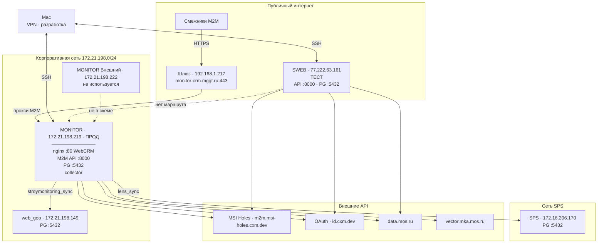

# MONITOR — статус доступности функций

**Основной (прод) сервер:** **MONITOR** — `172.21.198.219` (`LEN-MOSTRRAB-DCR-01P`, RED OS 8.0.2)  
**Путь проекта:** `/opt/monitor`  
**Дата проверки:** 2026-08-03 (MSK)  
**Архитектура:** один сервер **без DMZ-прослойки** (схема `mggt-DMZ/` устарела; план переезда — [`mggt_server/`](mggt_server/))  
**Публичный доступ (только API смежников):** `https://monitor-crm.mggt.ru` — **ok** (с SWEB: `/health` 200, `PUT /api/uuids` 201 → БД `.219`)  
**DNS:** интернет → `91.246.17.237`, корпсеть → `192.168.1.217`  
**Статус:** **основной прод** = `172.21.198.219`. Resync с SWEB ([`STAGE_FINAL_RESYNC_REPORT.md`](mggt_server/STAGE_FINAL_RESYNC_REPORT.md)): `crm.tasks` **46439**, WebCRM `index-0s08xR2m.js`. Пакет смежникам: [`mggt_server/API/`](mggt_server/API/).  
**Тестовый сервер:** **SWEB** — `77.222.63.161` (бывший прод; только тест)  
**MONITOR Внешний:** `172.21.198.222` (`LEN-MONSTRRAB-01P`) — **не используется** в прод-схеме

---

## Узлы инфраструктуры

| Имя | IP | Hostname | Роль | Сервисы |
|-----|-----|----------|------|---------|
| **MONITOR** | `172.21.198.219` | `LEN-MOSTRRAB-DCR-01P` | **Прод**, корпсеть | SSH `:22`, nginx `:80` (WebCRM), M2M API `:8000`, PG `:5432` |
| **Шлюз MGGT (внутр.)** | `192.168.1.217` | — | Split-horizon DNS / HTTP→HTTPS | `monitor-crm.mggt.ru` внутри сети |
| **Публичный IP домена** | `91.246.17.237` | — | Интернет HTTPS → `.219` | `/health` **ok**; M2M API live |
| **SWEB** | `77.222.63.161` | `77-222-63-161.swtest.ru` | **Тест** | SSH `:22`, MONITOR API `:8000`, PG `:5432`, WebCRM |
| **MONITOR Внешний** | `172.21.198.222` | `LEN-MONSTRRAB-01P` | Не используется (ex-DMZ) | SSH `:22` (на 2026-07-28 недоступен) |
| **web_geo** | `172.21.198.149` | — | Внешняя БД | PostgreSQL `:5432` |
| **SPS** | `172.16.206.170` | — | Внешняя БД | PostgreSQL `:5432` |
| **Mac** | VPN | — | Разработка / деплой | SSH к прод и SWEB |

SSH к SWEB: `ssh -i id_rsa/id_rsa root@77.222.63.161`  
SSH к прод: `ssh root@172.21.198.219`

### Доступ потребителей

| Потребитель | Канал | Адрес |
|-------------|-------|-------|
| Смежники (genplan M2M) | Интернет HTTPS | `https://monitor-crm.mggt.ru` ([`mggt_server/API/`](mggt_server/API/)) |
| WebCRM | Корпсеть / VPN | `http://172.21.198.219/` (bundle `index-0s08xR2m.js`) |
| Android (API + PG) | Корпсеть (VPN-приложение → LAN) | API `http://172.21.198.219:8000`, PG `172.21.198.219:5432` (TCP smoke ok) |
| Админы | VPN / SSH | `root@172.21.198.219` |

### API в проекте

Handoff для смежников: [`mggt_server/API/`](mggt_server/API/) (ONBOARDING, контракты, клиент; ключ — `credentials.local.md`, не в git).

**MONITOR M2M API** (входящие, порт `:8000` на сервере; снаружи через домен `:443`):

| Endpoint | Назначение |
|----------|------------|
| `GET /health` | Проверка доступности |
| `PUT /api/photos/meta/{uuid}` | Приём метаданных фото (genplan) |
| `PUT /api/uuids/{uuid}` | Регистрация UUID фото |
| `POST /api/mggtfield/photos` | Загрузка полевых фото (Android, VPN) |

**Внешние API** (исходящие, collector на MONITOR / SWEB):

| Сервис | Base URL | Endpoints | Job |
|--------|----------|-----------|-----|
| **MSI Holes** | `https://m2m.msi-holes.cxm.dev` | `POST /spatial_search`, `GET /api/photos/meta/{uuid}`, `POST /api/upload`, `GET /api/photos/images/{uuid}` | genplan_fetch, genplan_upload, genplan_fetch_uploaded, genplan_download |
| **MSI OAuth** | `https://id.cxm.dev` | `POST /oauth2/token` | авторизация MSI Holes |
| **data.mos.ru** | `https://apidata.mos.ru` | `GET /v1/datasets/{id}/features` | data_mos_* (8 датасетов) |
| **vector.mka** | `https://vector.mka.mos.ru` | `GET /api/2.8/orbis/map221/layers/rs_2022/export/` | vector_stroy_url_222 |

---

## Схема связей



### ASCII-схема (кратко)

```
  Интернет (смежники)          Корпсеть / VPN
         │                            │
         ▼                            ├── WebCRM  → http://172.21.198.219/
  monitor-crm.mggt.ru:443             ├── Android → :8000 + PG :5432
  (шлюз 192.168.1.217)                └── админы  → SSH
         │
         ▼
  ┌──────────────────────────────────────────┐
  │ MONITOR ПРОД · 172.21.198.219            │
  │  nginx :80 (WebCRM)                      │
  │  monitor-api :8000 · monitor-db :5432    │
  │  collector → SPS / web_geo / ext API     │
  └──────────────────────────────────────────┘

  SWEB 77.222.63.161 — ТЕСТ (не прод)

M2M API:
  GET  /health
  PUT  /api/photos/meta/{uuid}
  PUT  /api/uuids/{uuid}
  POST /api/mggtfield/photos   (Android, VPN)
```

**Ключевые выводы:**
- Прод — **один** узел `172.21.198.219`, без nginx-прокси на `.222`.
- Снаружи M2M — `https://monitor-crm.mggt.ru` (**ok** с 2026-08-03; проверка с SWEB).
- WebCRM и Android — **корпсеть**; Android VPN-приложение = LAN с полным доступом к серверу.
- SWEB — **тестовый** стенд (бывший прод); прямого маршрута SWEB ↔ корпсеть нет.
- Конфиг: [`mggt_server/SERVER.md`](mggt_server/SERVER.md), переезд: [`mggt_server/MIGRATION.md`](mggt_server/MIGRATION.md).

---

## Инфраструктура (прод `172.21.198.219`, 2026-08-03)

| Компонент | Статус | Детали |
|-----------|--------|--------|
| CPU / RAM | OK | 4 vCPU (AMD EPYC 7763), 15 GiB RAM, ~9.6 GiB swap |
| Диск `/` | OK | 489 GB |
| `nginx` | OK | `:80` — M2M → `:8000`; WebCRM `/api/` → `:8080` |
| `monitor-webcrm` | OK | uvicorn `:8080`; `DB_HOST=127.0.0.1`; SPA `index-0s08xR2m.js` |
| `monitor-db` | **OK** | PostGIS 16-3.4, healthy `:5432`; resync SWEB 2026-08-03 |
| `monitor-api` | **OK** | `:8000` `/health` → ok |
| `monitor-collector` | **OK** | Up |
| CRM | OK | `tasks` **46439** (= SWEB fingerprint) |
| Firewall | Active | corp `172.21.0.0/16` → 80/8000/5432; шлюз `192.168.1.217` → 80/8000 |
| Публичный TLS | Край `91.246.17.237` | **ok** → бэкенд `.219:80` |

---

## M2M API (genplan + полевые фото)

| Функция | Endpoint | Статус | Проверка |
|---------|----------|--------|----------|
| Health | `GET /health` | **OK** публично и на `.219` | `{"status":"ok"}` |
| Photo meta ingest | `PUT /api/photos/meta/{uuid}` | **OK** прод-домен | Bearer `MONITOR_API_KEY` |
| UUID ingest | `PUT /api/uuids/{uuid}` | **OK** прод-домен | с SWEB: **201** → `genplan.uuid_api` на `.219` |
| Полевые фото (Android) | `POST /api/mggtfield/photos` | VPN → `.219:8000` | Multipart `file` |

**Base URL для смежников (прод):** `https://monitor-crm.mggt.ru`  
**Base URL внутри VPN:** `http://172.21.198.219:8000`  
**Ключ API:** без изменений (из `.env` / [`mggt_server/API/credentials.local.md`](mggt_server/API/credentials.local.md))  
**Тест (SWEB):** `http://77.222.63.161:8000` — не использовать для прода

### Данные API в БД (последняя проверка на `.219` до остановки Docker, 2026-07-01)

| Таблица | Строк |
|---------|------:|
| `genplan.photo_meta` | 219 814 |
| `genplan.uuid_api` | 8 |
| `lens.reports` | 141 |
| `stroymonitoring.boundaries_aip` | 1 333 |

---

## ETL Jobs — планировщик

На прод-сервере collector **остановлен** с 21.07.2026. Ниже — статус последней рабочей проверки (2026-07-01) и ожидание после `docker compose up -d`.

### Cron (автоматические)

| Время MSK | Job | Статус (на 01.07) | Комментарий |
|-----------|-----|-------------------|-------------|
| 03:00 | `data_mos` (+ 8 датасетов, `ogh_disruption`) | **OK*** | Нужен повторный прогон после подъёма |
| 04:00 | `lens_pipeline` / `lens_sync` / `stroymonitoring_sync` | **OK*** | SPS / web_geo доступны с `.219` |
| 06:00 | `vector_stroy_url_222` | **OK*** | Skip без `url_222_wgs.geojson` |

\* Подтверждено до остановки контейнеров; после подъёма — проверить `collector.job_runs`.

### Ручные jobs

| Job | Статус | Комментарий |
|-----|--------|-------------|
| `genplan`, `genplan_upload`, `genplan_fetch_uploaded`, `genplan_download` | **OK*** | До остановки |
| `genplan_fetch` / `genplan_pipeline` | **FAIL** | MSI Holes `POST /api/spatial_search` → **HTTP 404** (не связано с миграцией) |

---

## Внешние зависимости

| Ресурс | Хост | Статус с `.219` | Назначение |
|--------|------|-----------------|------------|
| SPS (lens) | `172.16.206.170:5432` | **OK** (корпсеть) | `lens_sync` |
| web_geo | `172.21.198.149:5432` | **OK** | `stroymonitoring_sync` |
| MSI Holes API | `https://m2m.msi-holes.cxm.dev` | **Частично** | meta OK; spatial_search **404** |
| MSI Holes OAuth | `https://id.cxm.dev/oauth2/token` | **OK** | токен |
| data.mos.ru | `https://apidata.mos.ru` | **OK** | ключ в `.env` |

---

## Сетевая доступность

Проверка **2026-07-28**: зонд с Mac (VPN) и с **MONITOR** (`172.21.198.219`).

### Матрица связности (актуально)

| Откуда ↓ / Куда → | SWEB `:22` / `:8000` | MONITOR `:22` / `:80` | MONITOR `:8000` / `:5432` | SPS / web_geo |
|-------------------|----------------------|------------------------|---------------------------|---------------|
| **Mac** (VPN) | OK | OK / WebCRM OK | после подъёма Docker | OK |
| **MONITOR** `.219` | OK (исходящий) | локально | после подъёма | OK |
| **SWEB** `.161` | локально | **FAIL** (нет маршрута в корпсеть) | **FAIL** | **FAIL** |

### Публичный домен (актуально 2026-08-03)

| Проверка | Результат |
|----------|-----------|
| DNS с интернета (SWEB) | **`91.246.17.237`** |
| DNS с `.219` | **`192.168.1.217`** |
| HTTPS с SWEB на домен | **ok** — `/health` 200; `PUT /api/uuids` 201 → БД `.219` |
| Backend на `.219` | nginx **`:80`** → M2M `:8000` |

### Входящие доступы к MONITOR

| Порт | Сервис | Кто имеет доступ |
|------|--------|------------------|
| 22 | SSH | админы (VPN) |
| 80 | nginx (SPA + M2M proxy) | корпсеть `172.21.0.0/16`; шлюз `192.168.1.217` |
| 8000 | MONITOR M2M API | корпсеть; шлюз |
| 5432 | PostgreSQL | **только** корпсеть / localhost — **не** в интернет |

**Важно:** прод M2M — `https://monitor-crm.mggt.ru`. VPN: `http://172.21.198.219:8000`. Тест: `http://77.222.63.161:8000`.

---

## Схемы БД

| Схема | Таблиц | Статус |
|-------|-------:|--------|
| `data_mos` | 20 | OK (данные в volume) |
| `lens` | 11 | OK |
| `genplan` | 5 | OK |
| `stroymonitoring` | 1 | OK |
| `collector` | 1 | OK (`job_runs`) |
| `crm` | 7 | OK |
| `odh_export` | 4 | OK |
| `vector_stroy` | 1 | OK |

---

## Файлы и каталоги на диске

| Путь | Статус | Комментарий |
|------|--------|-------------|
| `/opt/monitor/.env` | OK | `MONITOR_API_PUBLIC_BASE_URL` — обновить на `https://monitor-crm.mggt.ru` при cutover |
| `/opt/monitor/webcrm/` | OK | код WebCRM; backend `.env` пока на SWEB |
| `/var/www/monitor-webcrm/` | OK | собранный frontend |
| `mggtfield_photo/` | OK | локальные полевые фото |
| `downloaded_photo/` | OK | ~117 MB |
| `jsons_genplan/` / `photo_to_upload/` | Пусто / skip | jobs ждут файлы |

---

## Известные проблемы

### 1. Docker-стек на прод остановлен (с 21.07.2026)

**Снято этапом 1 (2026-07-28):** volume wipe + restore с SWEB; `monitor-db` / `api` / `collector` Up.

### 2. WebCRM смотрит на БД SWEB

**Снято этапом 1:** `DB_HOST=127.0.0.1`, `PHOTO_SFTP_ENABLED=false`.

### 3. `genplan_fetch` / `genplan_pipeline` — MSI Holes 404

Проблема **не связана с миграцией**. Push-канал M2M и `genplan_fetch_uploaded` — рабочий обходной путь.

### 4. Firewall и шлюз

corp `172.21.0.0/16` → 80/8000/5432; шлюз `192.168.1.217` → 80/8000. PG в интернет не открыт. Публичный M2M через край → `.219:80` **ok** (2026-08-03).

### 5. DMZ `.222` отменена

Документация [`mggt-DMZ/`](mggt-DMZ/) описывает устаревшую двухузловую схему. Актуальный прод — [`mggt_server/`](mggt_server/).

---

## Сводка: что работает (2026-08-03)

| Категория | Работает | Примечание |
|-----------|----------|------------|
| **API** | публичный домен + `.219` | смежники → `https://monitor-crm.mggt.ru` |
| **Cron ETL** | collector Up | не гонять destructive CRM sync без нужды |
| **CRM** | tasks **46439** | resync SWEB |
| **Инфраструктура** | Docker, WebCRM, nginx, firewall | SWEB = тест |

---

## Команды для повторной проверки

```bash
# WebCRM (VPN)
curl -s http://172.21.198.219/health

# M2M после подъёма Docker (VPN)
curl -s http://172.21.198.219:8000/health

# M2M для смежников (интернет)
curl -s https://monitor-crm.mggt.ru/health

# Тест SWEB
curl -s http://77.222.63.161:8000/health

# Контейнеры (прод)
ssh root@172.21.198.219 'cd /opt/monitor && docker compose ps'

# Контейнеры (тест)
ssh -i id_rsa/id_rsa root@77.222.63.161 'cd /opt/monitor && docker compose ps'

# Последние jobs (после подъёма)
ssh root@172.21.198.219 'cd /opt/monitor && docker compose exec -T db psql -U monitor -d monitor -c "
SELECT job_name, status, left(message,60), started_at AT TIME ZONE '\''Europe/Moscow'\''
FROM collector.job_runs ORDER BY started_at DESC LIMIT 15;"'
```

---

## Cutover для потребителей

| Параметр | Было (SWEB, бывший прод) | Стало (MONITOR) |
|----------|--------------------------|-----------------|
| API смежников (интернет) | `http://77.222.63.161:8000` | `https://monitor-crm.mggt.ru` |
| API внутри VPN | — | `http://172.21.198.219:8000` |
| WebCRM | `http://77.222.63.161/` | `http://172.21.198.219/` (VPN) |
| PostgreSQL (Android, VPN) | `77.222.63.161` | `172.21.198.219` |
| PostgreSQL port | `5432` | `5432` |
| API key | — | без изменений |
| SWEB | прод | **тест** (не удалять) |

Пошаговый план / история: [`mggt_server/MIGRATION.md`](mggt_server/MIGRATION.md). Актуальный статус: [`mggt_server/CUTOVER_READY.md`](mggt_server/CUTOVER_READY.md).
