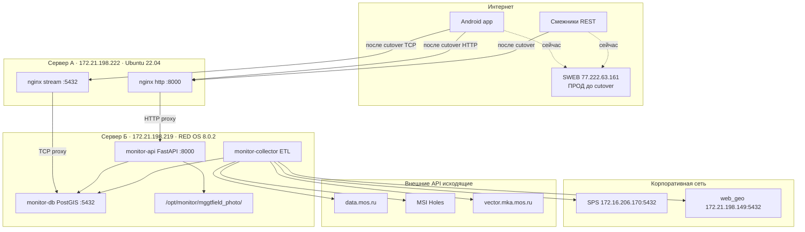

# Архитектура DMZ — MONITOR

## Схема (целевая)

## Роли серверов

### Сервер А — DMZ (`172.21.198.222`)

| Параметр | Значение |
|----------|----------|
| ОС | Ubuntu 22.04 |
| Docker | **Нет** |
| PostgreSQL | **Запрещено** |
| Постоянные файлы | **Запрещено** |
| Роль | Stateless TCP + HTTP прокси |
| Софт | nginx (stream + http) |

Проксирует:
- `:5432` → `172.21.198.219:5432` (PostgreSQL для Android)
- `:8000` → `172.21.198.219:8000` (MONITOR M2M API)

Загрузка фото проходит транзитом (`proxy_request_buffering off`) — файлы сохраняются на сервере Б.

### Сервер Б — Backend (`172.21.198.219`)

| Параметр | Значение |
|----------|----------|
| ОС | RED OS 8.0.2 |
| Путь | `/opt/monitor` |
| Docker Compose | `monitor-db`, `monitor-api`, `monitor-collector` |
| Входящий интернет | **Нет** (только от DMZ и админов) |
| Исходящий интернет | **Да** (collector → data.mos.ru, MSI, vector.mka) |

### SWEB — текущий прод (`77.222.63.161`)

Полный стек на одном сервере. Работает параллельно до cutover. **Не изменять** — см. [SWEB-SAFETY.md](SWEB-SAFETY.md).

## Порты

| Порт | Сервер А (DMZ) | Сервер Б (Backend) | Назначение |
|------|----------------|-------------------|------------|
| 22 | SSH | SSH | Администрирование |
| 5432 | nginx stream (вход) | monitor-db (вход от DMZ) | PostgreSQL |
| 8000 | nginx http (вход) | monitor-api (вход от DMZ) | REST API |

## Потоки данных

### Входящие (через DMZ)

1. **Смежники** → `PUT /api/photos/meta/{uuid}`, `PUT /api/uuids/{uuid}` → nginx :8000 → API → PostgreSQL
2. **Android (фото)** → `POST /api/mggtfield/photos` → nginx :8000 → API → диск на сервере Б
3. **Android (БД)** → TCP :5432 → nginx stream → PostgreSQL на сервере Б

### Исходящие (только сервер Б)

| Job | Время MSK | Назначение |
|-----|-----------|------------|
| `data_mos` | 03:00 | apidata.mos.ru |
| `lens_pipeline` | 04:00 | SPS `172.16.206.170` |
| `vector_stroy_url_222` | 06:00 | vector.mka.mos.ru |

## Сетевая связность

| Откуда → Куда | Результат |
|---------------|-----------|
| SWEB ↔ `172.21.198.x` | **Нет маршрута** |
| DMZ `.222` → Backend `.219` | **OK** |
| Backend `.219` → SPS, web_geo | **OK** |
| Backend `.219` → внешние API | **OK** |
| DMZ `.222` → интернет | Пока нет (внешний IP выдадут позже) |

## Этапы адресации

| Этап | API | PostgreSQL |
|------|-----|------------|
| 1. Сейчас | `77.222.63.161:8000` | `77.222.63.161:5432` |
| 2. Внутренний тест | `172.21.198.222:8000` | `172.21.198.222:5432` |
| 3. Прод через DMZ | `<DMZ_PUBLIC_IP>:8000` | `<DMZ_PUBLIC_IP>:5432` |
