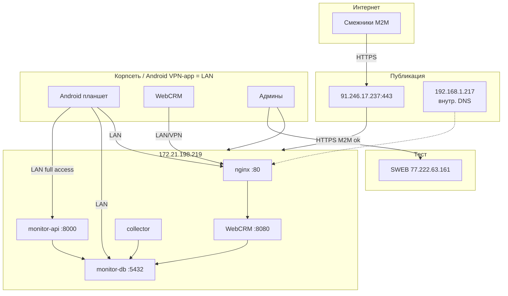

# MONITOR — план переезда на единый сервер MGGT

**Цель:** полный прод на `172.21.198.219` без DMZ-прослойки (`.222`).  
**SWEB** (`77.222.63.161`) остаётся **тестовым** стендом (не удалять).  
**Снаружи:** только M2M API смежников — `https://monitor-crm.mggt.ru:443`.  
**VPN / корпсеть:** WebCRM и Android.

Конфигурация сервера: [SERVER.md](SERVER.md).  
Статус: [../acses_status.md](../acses_status.md).  
Устаревшая схема DMZ: [../mggt-DMZ/](../mggt-DMZ/) — **не использовать** как целевую.

---

## 1. Роли после переезда

| Узел | Роль |
|------|------|
| `172.21.198.219` | Единственный **прод**: PG, M2M API, collector, WebCRM |
| `192.168.1.217` | Внутренний DNS/HTTP-фронт домена (split-horizon) |
| `91.246.17.237` | Публичный IP `monitor-crm.mggt.ru` (интернет) |
| `77.222.63.161` (SWEB) | **Тест** |
| `172.21.198.222` | Не используется |



---

## 2. Адреса потребителей

| Потребитель | Канал | URL / host |
|-------------|-------|------------|
| Смежники (genplan M2M) | Интернет `:443` | `https://monitor-crm.mggt.ru` |
| WebCRM | Корпсеть / VPN-app | `http://172.21.198.219/` |
| Android API | Корпсеть (VPN-приложение → LAN) | `http://172.21.198.219:8000` |
| Android PostgreSQL | Корпсеть (VPN-приложение → LAN) | `172.21.198.219:5432` · БД `monitor` · user `monitor` |
| Админы | VPN / SSH | `ssh root@172.21.198.219` |
| Тест M2M | Интернет / VPN | `http://77.222.63.161:8000` |

API-ключ (`MONITOR_API_KEY`) — **без изменений**.

### M2M endpoints (смежники)

| Метод | Путь |
|-------|------|
| `GET` | `/health` |
| `PUT` | `/api/photos/meta/{uuid}` |
| `PUT` | `/api/uuids/{uuid}` |

`POST /api/mggtfield/photos` — для Android по VPN на `:8000` (не обязан идти через публичный домен).

---

## 3. Исходное состояние → после этапа 1 (2026-07-28)

- На `.219`: Docker db/api/collector **Up**; БД = полный restore с SWEB; CRM counts совпали.
- WebCRM: `DB_HOST=127.0.0.1`, без SFTP на SWEB.
- `MONITOR_API_PUBLIC_BASE_URL=https://monitor-crm.mggt.ru`
- Фото: `downloaded_photo` 987M, `mggtfield_photo` 6.6G
- SWEB: тест, контейнеры Up (не останавливали)
- Публичный HTTPS по-прежнему **403** (этап 0)

### Финальный resync данных — **выполнено 2026-08-03**

Полный wipe+restore БД, rsync фото и WebCRM с SWEB (SWEB Up, не останавливали).  
Отчёт: [`STAGE_FINAL_RESYNC_REPORT.md`](STAGE_FINAL_RESYNC_REPORT.md)

| Объект | Значение (SWEB = `.219`) |
|--------|--------------------------|
| `crm.tasks` (+ fingerprint) | **46439** (MD5 совпал) |
| `genplan.photo_meta` | **220107** |
| WebCRM JS | `index-0s08xR2m.js` |
| Фото | `downloaded_photo` 987M, `mggtfield_photo` ~7.8–7.9G |

- [x] БД 1:1 с SWEB
- [x] Фотокаталоги синхронизированы
- [x] WebCRM код+статика как на SWEB; `.env` localhost сохранён

---

## 4. Этапы переезда

Выполнять по порядку. SWEB до явного cutover смежников **не останавливать**.

### Этап 0. Разведка сети — **выполнено 2026-07-28**

Проверки с SWEB (только `curl` / DNS / `docker compose ps`, контейнеры **не** трогали) и с `.219` (маркер `:8000`, tcpdump, nginx access.log).

#### DNS (split-horizon)

| Откуда | `monitor-crm.mggt.ru` → |
|--------|-------------------------|
| Интернет (SWEB `77.222.63.161`) | **`91.246.17.237`** |
| Корпсеть (`.219`) | **`192.168.1.217`** |

#### Публичный HTTPS

| Источник | `https://monitor-crm.mggt.ru/` и `/health` |
|----------|---------------------------------------------|
| SWEB | **403 Forbidden** — HTML `<h1>Forbidden</h1>` + `Request ID: …` (ответ края, не nginx `.219`) |
| `.219` через `--resolve …:91.246.17.237` | тот же **403** |
| Mac (эта сессия) | до публичного IP не достучались (локальный прокси / сеть) |

Внутренний `http://192.168.1.217/` (Host: домен) → **301** на `https://monitor-crm.mggt.ru/`.  
`https://192.168.1.217/` с `.219` → **timeout**.

#### Проброс `:80` vs `:8000` на `.219`

| Наблюдение | Результат |
|------------|-----------|
| На `.219` во время внешних curl | nginx access.log **без новых** записей |
| tcpdump `ens192` dst/src port 80/8000 | **нет** пакетов на `172.21.198.219`; шум только чужих хостов LAN |
| Временный маркер `python3 -m http.server 8000` (`BACKEND_8000`) | поднят и снят; снаружи тело маркера **не** появилось (из‑за 403 на крае) |

**Вывод этапа 0:** backend-порт публикации (**`:80` или `:8000`) не подтверждён** — трафик с интернета **не доходит** до `.219`, обрывается ACL/WAF на `91.246.17.237` (403). Source IP шлюза для firewalld **не пойман**. Повторить tcpdump + маркер после открытия ACL для смежников.

Рабочая гипотеза до повторной проверки: готовить приём на **`:80`** (nginx уже слушает; удобно развести M2M location’ы) и уметь принять проброс на **`:8000`**, если край укажет туда.

SWEB после этапа 0: `monitor-api` / `monitor-collector` / `monitor-db` — **Up** (без изменений).

#### Android

VPN-приложение на планшете выводит устройство в **корпсеть (LAN)** с полным доступом к `172.21.198.219`. Отдельный список VPN CIDR для firewall **не нужен** на этапе 0; проверка портов `:80` / `:8000` / `:5432` — с планшета после подъёма стека.

- [x] DNS интернет vs корпсеть зафиксированы
- [x] Ответ с интернета: **403 ACL**
- [x] Backend `:80` vs `:8000`: **не видно (трафик не доходит)**
- [x] Source IP шлюза: **не определён**
- [x] Android = LAN via VPN-app
- [x] SWEB контейнеры остались Up

### Этап 1. Wipe `.219` + restore БД с SWEB — **выполнено 2026-07-28**

Метод: полный `pg_dump -Fc` БД `monitor` с SWEB → Mac → `.219` `pg_restore` (SWEB↔`.219` напрямую нет маршрута). SWEB только читали; контейнеры SWEB остались **Up**.

#### Pre-flight / verify counts (SWEB = `.219`)

| Объект | SWEB | `.219` после restore |
|--------|-----:|---------------------:|
| `crm.tasks` | 45253 | 45253 |
| `crm.tasks_field` | 33678 | 33678 |
| `crm.tasks_area` | 427 | 427 |
| `crm.tasks_clear` | 3474 | 3474 |
| `crm.users` | 13 | 13 |
| `crm.statistics` | 5332 | 5332 |
| `data_mos` split с `task_key` (12 таблиц) | 33568 | 33568 |
| orphan `tasks_field` / `data_mos.task_key` | — | **0** / **0** |

Dump: `monitor_sweb_20260728.dump` (~293 MB, `-Fc -Z6`).  
`pg_restore` на stock `postgis/postgis:16-3.4`: 6 ошибок только по **`pg_cron`** (расширение нет в образе) — на CRM/данные не влияет.

#### Стек на `.219`

- Wipe: `docker compose down` + `docker volume rm monitor_pgdata`
- Up: `monitor-db` healthy, `monitor-api` (`/health` ok), `monitor-collector` Up
- `MONITOR_API_PUBLIC_BASE_URL=https://monitor-crm.mggt.ru`
- WebCRM: `DB_HOST=127.0.0.1`, `PHOTO_SFTP_ENABLED=false`, restart ok, `/health` ok
- Фотокаталоги: rsync с SWEB завершён — `downloaded_photo` **987M**, `mggtfield_photo` **6.6G** на `.219`

- [x] Устаревший volume на `.219` удалён
- [x] БД = копия SWEB, CRM counts совпали, orphans = 0
- [x] api/collector/db Up; health ok
- [x] WebCRM на localhost БД
- [x] Фотокаталоги на `.219` (987M + 6.6G)
- [x] SWEB контейнеры Up

**Не запускать** на `.219` деструктивные WebCRM SQL / повторный `deploy.sh` с `28_cleanup_*` — см. [../docs/webcrm_tasks_deletion_investigation.md](../docs/webcrm_tasks_deletion_investigation.md).

### Этап 2. Переключить WebCRM на локальную БД — **сделано в этапе 1**

| Было | Стало |
|------|-------|
| `DB_HOST=77.222.63.161` | `DB_HOST=127.0.0.1` |
| `PHOTO_SFTP_ENABLED=true` | `PHOTO_SFTP_ENABLED=false` |

- [x] WebCRM читает локальный PostGIS (`count crm.tasks` = 45253)
- [x] Фото на локальном диске (`downloaded_photo` 987M, `mggtfield_photo` 6.6G)

### Этап 3. Nginx: развести WebCRM и M2M — **выполнено 2026-07-28**

Конфиг: [`nginx/monitor-webcrm.conf`](nginx/monitor-webcrm.conf)  
Отчёт проверок и замечаний: [`STAGE3_REPORT.md`](STAGE3_REPORT.md)  
Бэкап на сервере: `/etc/nginx/conf.d/monitor-webcrm.conf.bak.stage3`

| Location | Upstream |
|----------|----------|
| `= /health`, `/api/photos/meta/`, `/api/uuids/`, `/api/mggtfield/` | `127.0.0.1:8000` (M2M) |
| `/api/` (остальное) | `127.0.0.1:8080` (WebCRM) |
| `/` | SPA |

- [x] M2M пути на `:8000` (доказано `401` Bearer через `:80`)
- [x] Остальной `/api/` WebCRM на `:8080` (доказано `/api/auth/login`)
- [x] SPA WebCRM открывается по `:80`

> `location = /health` = M2M. Health WebCRM: напрямую `:8080`.

### Этап 4. Firewalld + только M2M снаружи — **выполнено 2026-07-28**

Скрипт: [`firewall/server-firewalld.sh`](firewall/server-firewalld.sh)  
nginx geo: [`nginx/monitor-webcrm.conf`](nginx/monitor-webcrm.conf)  
Отчёт: [`STAGE4_REPORT.md`](STAGE4_REPORT.md)

| Source | Ports |
|--------|-------|
| `172.21.0.0/16` | `80`, `8000`, `5432` |
| `192.168.1.217` (шлюз) | `80`, `8000` (без PG) |
| `127.0.0.1` | `5432` |

Внешним через nginx доступны только M2M paths; SPA/WebCRM `/api/` → `403` если не `172.21.0.0/16`.

- [x] Legacy `.222` rules удалены
- [x] Corp + шлюз настроены; PG не для шлюза
- [x] nginx geo для WebCRM/SPA
- [x] Шлюз/край достучался до M2M (2026-08-03: `/health` 200, `PUT uuid` 201 с SWEB)

### Этап 5. Обновить `.env` стека — **сделано в этапе 1**

```env
MONITOR_API_PUBLIC_BASE_URL=https://monitor-crm.mggt.ru
```

- [x] Публичный base URL обновлён

### Обновление WebCRM (код + статика) — **выполнено 2026-07-28**

Источник: SWEB (`77.222.63.161`) через Mac. Локальный `backend/.env` сохранён (`DB_HOST=127.0.0.1`).  
SQL не гоняли (схема уже из dump этапа 1).  
Отчёт: [`STAGE_WEBCRM_UPDATE_REPORT.md`](STAGE_WEBCRM_UPDATE_REPORT.md)

- [x] Бэкап `/opt/monitor/webcrm` + `/var/www/monitor-webcrm`
- [x] rsync код и SPA; `pip` + `systemctl restart monitor-webcrm`
- [x] Bundle `index-BDGpf9Fu.js`; `crm.tasks` = 45253

### Этап 6. Проверки — **выполнено 2026-08-03**

| Проверка | Факт |
|----------|------|
| M2M VPN `:8000` / nginx `:80` | **ok** |
| M2M интернет | **ok** (`https://monitor-crm.mggt.ru/health` → 200 с SWEB) |
| `PUT /api/uuids` с интернета | **201**, запись на `.219` |
| WebCRM | **ok** (`index-0s08xR2m.js`) |
| SWEB | тест, Up |

Сводка: [`CUTOVER_READY.md`](CUTOVER_READY.md). Пакет: [`API/`](API/).

### Этап 7. Cutover — **прод = `.219` (2026-08-03)**

1. Публичный доступ открыт (см. [`API/ACL_REQUEST.md`](API/ACL_REQUEST.md) — решено).
2. Base URL смежников: `https://monitor-crm.mggt.ru` ([`API/ONBOARDING.md`](API/ONBOARDING.md)).
3. SWEB `http://77.222.63.161:8000` — только **тест**.
4. Android / WebCRM — внутренние адреса §2 (VPN).
5. На SWEB не делать `docker compose down -v`; не слать прод-ingest на SWEB.

| Параметр | Было | Стало |
|----------|------|-------|
| API смежников | `http://77.222.63.161:8000` | `https://monitor-crm.mggt.ru` |
| WebCRM | `http://77.222.63.161/` | `http://172.21.198.219/` (VPN) |
| PG Android | `77.222.63.161` | `172.21.198.219` (VPN) |

---

## 5. Rollback

Если cutover срывается:

1. Сообщить смежникам временно снова `http://77.222.63.161:8000`.
2. При необходимости WebCRM:
   ```env
   DB_HOST=77.222.63.161
   PHOTO_SFTP_ENABLED=true
   PHOTO_SFTP_HOST=77.222.63.161
   ```
   `systemctl restart monitor-webcrm`
3. SWEB: `docker compose up -d` (если останавливали сервисы).

Данные, записанные только на `.219` после переключения WebCRM/M2M на локальную БД, на SWEB **не появятся** автоматически.

---

## 6. Чеклист готовности

- [x] Этап 0: DNS и 403 ACL зафиксированы; позже доступ открыт (2026-08-03)
- [x] Wipe + restore БД с SWEB; Docker db/api/collector Up; CRM counts совпали
- [x] Финальный resync 2026-08-03: tasks **46439**, fingerprint 1:1, WebCRM `index-0s08xR2m.js` ([STAGE_FINAL_RESYNC_REPORT.md](STAGE_FINAL_RESYNC_REPORT.md))
- [x] WebCRM на localhost БД, без SFTP на SWEB
- [x] WebCRM код+статика с SWEB
- [x] Nginx разводит M2M и WebCRM (этап 3; [STAGE3_REPORT.md](STAGE3_REPORT.md))
- [x] Firewalld: corp `172.21.0.0/16` + шлюз `192.168.1.217` на 80/8000; PG не в интернет ([STAGE4_REPORT.md](STAGE4_REPORT.md))
- [x] `MONITOR_API_PUBLIC_BASE_URL=https://monitor-crm.mggt.ru`
- [x] `https://monitor-crm.mggt.ru/health` → ok (2026-08-03, проверка с SWEB)
- [x] Фотокаталоги с SWEB на `.219`
- [x] WebCRM проверен; Android API/PG — TCP smoke с Mac/VPN
- [x] Прод = `.219`; смежники на домен `https://monitor-crm.mggt.ru` ([CUTOVER_READY.md](CUTOVER_READY.md), [`API/`](API/))
- [x] SWEB оставлен как тест
- [x] Обновлены [../acses_status.md](../acses_status.md), этот документ, [`CUTOVER_READY.md`](CUTOVER_READY.md), [`SERVER.md`](SERVER.md)

---

## 7. Связанные документы

| Файл | Назначение |
|------|------------|
| [SERVER.md](SERVER.md) | Железо, порты, systemd, firewall, Docker |
| [CUTOVER_READY.md](CUTOVER_READY.md) | Прод = `.219`; публичный M2M ok |
| [STAGE_FINAL_RESYNC_REPORT.md](STAGE_FINAL_RESYNC_REPORT.md) | Финальный resync БД+фото+WebCRM 2026-08-03 |
| [API/](API/) | Пакет M2M для смежников |
| [STAGE_WEBCRM_UPDATE_REPORT.md](STAGE_WEBCRM_UPDATE_REPORT.md) | Обновление WebCRM с SWEB на `.219` |
| [../acses_status.md](../acses_status.md) | Оперативный статус |
| [../mggt-DMZ/](../mggt-DMZ/) | Устаревшая схема DMZ+Backend |
| [../mggtfield-photo-api-doc.md](../mggtfield-photo-api-doc.md) | API полевых фото (обновить URL при cutover) |
